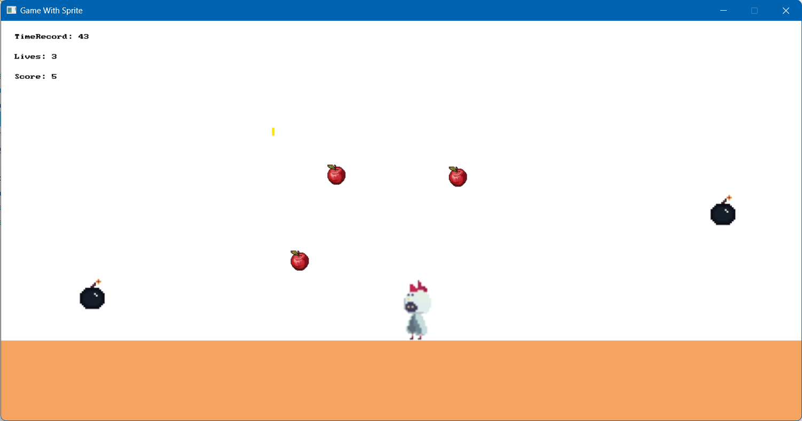
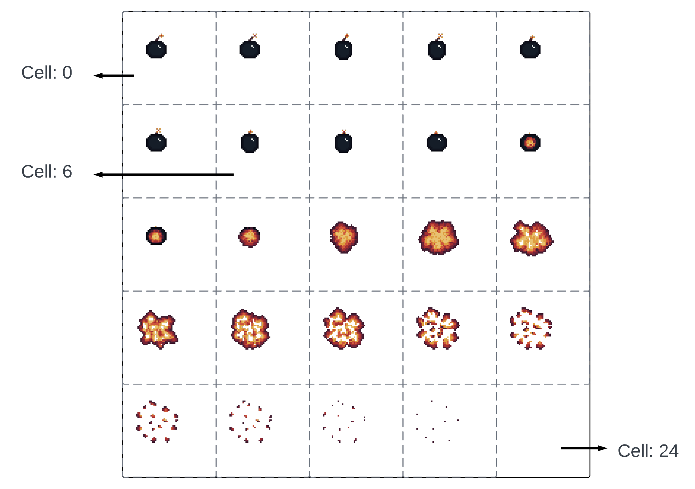

<a name="readme-top"></a>

# Walkthrough - Game with Sprites and Animation using C# SplashKit

SplashKit is a powerful tool that we can develop different types of games by utilizing OOP concepts together with their packages. 

This is a walkthrough of creating an **AnimatedItemCatch** game made by C# SplashKit, **using Sprite to handle player’s movement and animation**.

This walkthrough includes 5 main parts: introduction, game overview, implementation, conclusion and acknowledgement.

- In the introduction, I will:
    - Provide basic information about Animation in SplashKit: frame, duration, bitmap, cell, animation script.
    - Provide basic information about Sprite in SplashKit: step by step how to animate a Sprite, together with example code. 
- In the game overview, I will:
    - Provide an general game ideas of the **AnimatedItemCatch** game.
    - Provide an overview of the classes and logic in **AnimatedItemCatch game**.
- In the implementation, I will implement all the classes for the game.

In general, this walkthrough implements some features that relates to Sprite:

- Create and manage Sprites: Sprites for Player animation, Sprite for Bomb animation and Sprite for static Apple (with no animation).
- Different ways of Sprite management:
    - Handle multiple Sprites and switch between them → demonstrated by the **Player** class, which are IdleLeftSprite, IdleRightSprite, RunLeftSprite and RunRightSprite.
    - Handle single Sprite with different animation → demonstrated by the **Bomb** class (inherited from **Item** class), which is BombSprite with IdleAnimation and ExplodeAnimation
    - Handle single Sprite with no animation → demonstrated by the **Apple** class (inherited from **Item** class)
- Use Sprite’s API to check collision between Player and Items (Bomb and Apple), followed by different actions:
    - **Bombs** will explodes when hitting the player, animation will switch from IdleAnimation to ExplodeAnimation. After the ExplodeAnimation ends, the Bomb disappear.
    - **Apples** will disappear immediately when hitting the player, and has no animation.

Screencast of the game while running can be found at: [Game with animation using Sprite in SplashKit - C#](https://youtu.be/l3gkwFXfVLA)



# Table of Contents
<summary>
    <h3>Table of Contents</h3>
    <ol>
        <li>
            <a href="#1-introduction">Introduction</a>
            <ul>
                <li><a href="#11-animation-in-splashkit-frame-duration-bitmap-cell-animation-script">Animation in SplashKit</a></li>
                <li><a href="#12-sprite-in-splashkit">Sprite in SplashKit</a></li>
            </ul>
        </li>
        <li><a href="#2-game-overview">Game overview</a></li>
        <li>
            <a href="#3-implementation">Implementation</a>
            <ul>
                <li><a href="#31-the-player-class">The Player Class</a></li>
                <li><a href="#32-the-item-abstract-class-and-its-child-class">The Item Abstract Class and its Child Classes</a></li>
                <li><a href="#33-the-animateditemcatch-class">The AnimatedItemCatch Class</a></li>
                <li><a href="#34-the-main-program">The Main Program</a></li>
            </ul>
        </li>
        <li><a href="#4-conclusion">Conclusion</a></li>
        <li><a href="#5-acknowledgements">Acknowledgement</a></li>
    </ol>
</summary>

# 1. Introduction

## 1.1 Animation in SplashKit (frame, duration, bitmap, cell, animation script)

<aside>
💬 This part is a summary of the related concepts, for more information please refer to:

- SplashKit’s official api documentation: [Animations | SplashKit](https://splashkit.io/api/animations/)
- SplashKit’s official animation guide: [Using Animations | SplashKit](https://splashkit.io/guides/03-00-animation/)
</aside>

To create animation, we should understand that:

- **Animation** can also be known as a digital flip book that we display the images sequentially in a short time.
    - Each page/image in that flip book we call a **frame**.
    - Frames must be displayed one by one in sequential order in a fixed **duration**, which will be defined in **animation script.**
- **Bitmap image with cells** will be used to create animation in SplashKit:
    - Cells are the parts of an image. Each cell represent a motion in an activity.
    - Cells are linked with corresponding frames, which will also be defined in **animation script.**
    - Each cell can be accessed by its index. Starting from 0, they are numbered from top to bottom, and from left to right.
- **Animation script** in SplashKit is a text file that store all related information to animate the cells in a Bitmap image. In this text file, we will:
    - Define the heading “SplashKit Animation” in the first line, identifying this is an animation script.
    - Define the frames by starting a line with “**f:”**, then followed by the current frame identifier, cell number, duration, next frame identifier. This can be done in 2 ways, individuals or grouped:
        - Individually define the frame 0 and frame 1. Frame 0 is linked with cell 0, has duration of 6 times to be updated, next frame is frame 1. Frame 1 is similar to frame 0, but has next frame is frame 0. These two frames will form an continuous loop, until we stop or change the animation.
            
            ```
            f:0,0,6,1
            f:1,1,6,0
            ```
            
        - Grouping the above frames into one line, we can use:
            
            ```
            f:[0-1],[0-1],6,0
            ```
            
    - Define the animation identifiers, so that we can use this in our program. Animation identifiers should be started with “**i:**”, followed by animation name and starting frame id. Animation identifier of a bomb bitmap (image attached below) can be written as:
        
        ```
        i:IdleAnimation,0
        i:ExplodeAnimation,9
        ```
        
    - Define the sound effect to be played when animating a specific frame. Sound effects should be started with “**s:**”, followed by the linked frame identifer, sound name and file path. For example, we want the explosion sound to be played when the ExplodeAnimation start, which is frame 9, the script can be:
        
        ```
        // Sound effects: linked frame identifier, sound name, filepath
        s:9,ExplosionSound,explosion.mp3
        ```
        

Below is an example of a Bitmap image (original image credit to **AleezuX)** that can be divided into 25 parts, each part is a motion of an explosion. Each cell is annotated by a unique index, start from 0.



<p align="right">(<a href="#table-of-contents">Back to Table of Contents</a>)</p>

## 1.2 Sprite in SplashKit

SplashKit’s Sprite is an API that allows us to create images that we can easily move and animate. To create a Sprite, we need:

- A **Bitmap** image with defined cell details.
- An **AnimationScript** that has frames detail and **animation name**

The steps below describes the basic flows need to go through when using animation in SplashKit:

1. Create a window on which we will draw the animation.
2. Load the **Bitmap** image with cells, as well as define its cell detail. Ways to do this:
    - Load automatically by bundle (For more detail, refer to SplashKit’s bundle)
    - Load manually one by one:
        - Load the Bitmap image.
        - Define the cell detail including cell width, cell height, number of columns, number of rows and total cells.
3. Create an **AnimationScript** object by giving its name and path to the text file of animation script.
4. Create a Sprite using loaded Bitmap and **AnimationScript**
5. Start animation using animation name, which is defined in animation script.
6. Looping the animation until we close the window:
    - Let SplashKit to process events.
    - Clear window with a color, usually white.
    - Draw the Sprite on current window.
    - Refresh the window to make changes.
    - Update Sprite animation (This is important, Sprite will stay on first frame if we don’t update animation)

```csharp
// Step 1: Create a game window
Window gameWindow = new Window("Game With Sprite", 300, 300);

// Step 2: Load bitmap & define the cell detail
Bitmap _ChikBoyBitmap = SplashKit.LoadBitmap("ChikBoyBitmap", "ChikBoy_idle_right.png");
_ChikBoyBitmap.SetCellDetails(96, 96, 1, 6, 6);

// Step 3: Load the animation script
AnimationScript _IdleAnimationScript = SplashKit.LoadAnimationScript("ChikBoyIdleScript", "chikboy_idle.txt");

// Step 4: Instead of create Animation, we create Sprite
// Animation _ChikBoyAnimation = _IdleAnimationScript.CreateAnimation("IdleRightAnimation");
Sprite _ChikBoySprite = SplashKit.CreateSprite(_ChikBoyBitmap, _IdleAnimationScript);

// Step 5: Set position for the Sprite
_ChikBoySprite.X = 50;
_ChikBoySprite.Y = 50;

// Step 6: Start animation using animation name, which is defined in animation script
_ChikBoySprite.StartAnimation("IdleRightAnimation");

// Step 7: Looping the animation
while(! gameWindow.CloseRequested) {
    SplashKit.ProcessEvents();
    gameWindow.Clear(Color.White);
    _ChikBoySprite.Draw();
    gameWindow.Refresh(60);
    _ChikBoySprite.UpdateAnimation();
}
```

Other features such as switching Sprites/Animation based on user input, interaction between Sprites,… will be discussed in the implementation part.

<p align="right">(<a href="#table-of-contents">Back to Table of Contents</a>)</p>

# 2. Game overview

Below is some overview of the game of **AnimatedItemCatch** game.

1. General game ideas:

This game ideas is similar to the **ItemCatch** game ****I made before. You can refer to my tutorial on **ItemCatch** game at ‣. 

In general, the ideas are:

- Player is able to move on the screen horizontally.
- Items will slowly fall from the top. There are 2 types of items:
    - **Bomb**: A danger item that we need to dodge it, player will reduce lives when interact with bombs.
    - **Apple**: A safe item that we should receive, player will increase score when interact with apples.
- Game records includes remaining lives, scores gained from receiving apples, and the time we can survive.
- There is no limit of time for playing, player can press ESC to exit the game.
1. Overview of classes and logic:

The game has 3 main type of objects, including **`Player`** , **`Item`**  and **`AnimatedItemCatch`**:

- The **`Player`** class is used to create a player object, which can run around the screen horizontally.
- The **`Item`** abstract class is used to create items falling from top of the screen. It has 2 child class, **`Apple`** and **`Bomb`**
- The **`AnimatedItemCatch`** class is used to manage the game, including the player and items, as well as their interaction.

Overall key features/concept of the **`Player`** class:

- Has different Sprites for different animation (IdleLeft, IdleRight, RunLeft, RunRight). These Sprites will be alternatively used and animated based on the user input.
- Can receive items by checking the collision between the player’s Sprite and item’s Sprite. Based on the item’s type (apple or bomb), the player will increase score or reduce lives.

Overall key features/concept of the **`Item` abstract class.** It has 2 **child classes**, the Bomb and Apple:

- These 2 child classes store different Sprite.
    - The **`Bomb`** ’s ****Sprite has 2 type of animation, which are “IdleAnimation” and “ExplodeAnimation”.
    - The **`Apple`** ’s ****Sprite has no animation.
- When the item hit the player:
    - The **`Bomb`** will stop falling and start exploding animation. It will disappear after the animation ends.
    - The **`Apple`** will be collected by the player and disappear immediately.

Overall key features/concept of the **`AnimatedItemCatch`** class, which will manage the game, as well as it components:

- Has fields for storing player and items, as well as other fields for the game to operate.
- It includes methods for:
    - Handle the user input and let the player stay on the screen.
    - Update the game objects (update game progress, update item, check collision,…)
    - Draw game objects (clear window, draw background, draw player, draw item, draw progress, refresh window)
    - Checking the collision between player and items:
        - If they are received or offscreen → remove items
        - If the received item is a Bomb → reduce the player’s lives.
        - If the received item is an Apple → increase the player’s score.

<p align="right">(<a href="#table-of-contents">Back to Table of Contents</a>)</p>

# 3. Implementation

<aside>
💬 In the implementation part, this tutorial will use:

- Some free game assets from [itch.io](https://itch.io/game-assets)
    - For Player’s Sprite, thanks **9EO** for sharing free asset: [Chick-Boy Animation Pack by 9E0 (itch.io)](https://9e0.itch.io/chick-boy)
    - For Apple’s Sprite, thanks **elenetari** for sharing free asset: [apple sprites by elenetari (itch.io)](https://elenetari.itch.io/apple-sprites)
    - For Bomb’s Sprite, thanks **AleezuX** for sharing free asset: [Free Sprite BOOM by AleezuX (itch.io)](https://aleezux.itch.io/free-sprite-bom)
- Some sound effects from [Pixabay](https://pixabay.com/sound-effects/?utm_source=link-attribution&utm_medium=referral&utm_campaign=music&utm_content=103779)
    - For the Apple’s sound (*receive-apple.mp3),* refer to “Take Item Sound Effect” by [zennnsounds](https://pixabay.com/users/zennnsounds-35538808/?utm_source=link-attribution&utm_medium=referral&utm_campaign=music&utm_content=163073) from [Pixabay](https://pixabay.com//?utm_source=link-attribution&utm_medium=referral&utm_campaign=music&utm_content=163073)
    - For the Bomb’s sound (*explosion.mp3*), refer to “small explosion” by [Pixabay](https://pixabay.com/sound-effects/?utm_source=link-attribution&utm_medium=referral&utm_campaign=music&utm_content=103779)
</aside>

Before going to implementation, we need to prepare the bitmaps and animation scripts.

- Bitmaps can be found on [itch.io](http://itch.io). This website provides game assets for free or paid.
- Animation scripts will be created based on the bitmaps (as discussed above)
    - The player’s idle animation has 2 side, left and right. Although the Sprite use different bitmap image, we use the same animation script since the order of frames and cells is the same.
        - The idle left/right bitmap has dimension 96x576, with 1 column and 6 rows. Therefore, we will have 6 cells for 6 frames, each cell will be 96x(576/6). This cell information will be defined later in the **`Player`** class.
        - In the animation script, we define the frame id, linking with the cell numbers (start from 0), the duration and repeat the first frame after complete this animation.
        
        ```
        SplashKit Animation
        
        // Define the frames: frame identifier(s), cell number(s), duration, next frame
        // If next frame is not defined => no continuous animations (stopped after run all frame)
        f: [0-5], [0-5], 6, 0
        
        // Animation dentifiers: identifier name, starting frame
        i:IdleLeftAnimation,0
        i:IdleRightAnimation,0
        ```
        
    - Similar to the player’s run animation. After doing the same analysis and calculation, we also create the text file as below:
        
        ```
        SplashKit Animation
        
        // Define the frames: frame identifier(s), cell number(s), duration, next frame
        // If next frame is not defined => no continuous animations (stopped after run all frame)
        f: [0-9], [0-9], 6, 0
        
        // Animation dentifiers: identifier name, starting frame
        i:RunLeftAnimation,0
        i:RunRightAnimation,0
        ```
        
    - The bomb’s animation is slightly different from the player. In the same image, it include both idle and exploding animation, so we will assign the first 9 frames/cells for the idle animation, and the remaining frames/cells for exploding animation.
        
        ```
        SplashKit Animation
        
        // Define the frames: frame identifier(s), cell number(s), duration, next frame
        // If next frame is not defined => no continuous animations (stopped after run all frame)
        f:[0-8],[0-8],6,0
        f:[9-24],[9-24],3,
        
        // Animation dentifiers: identifier name, starting frame
        i:IdleAnimation,0
        i:ExplodeAnimation,9
        
        // Sound effects: linked frame identifier, sound name, filepath
        s:9,ExplosionSound,explosion.mp3
        ```
        

### 3.1 The Player Class

For the **`Player`** class, because the animations are in separated files, we will create different Sprites from different images and animation scripts. These Sprites will be animated based on user input.

In implementation, we will add the fields and methods for the player:

- About the fields/properties:
    - `SPEED` : which will store the player’s basic speed.
    - `Lives`, `TimeRecord`, `Scores`: which are the properties of the game progress.
    - `LandHeight`: which store the height of the land that the player stands on.
    - `Quit`: which store boolean value, the game will ends if it is *true.*
    - Add some fields for storing and controlling Sprite:
        - `_CurrentSprite`: which will store currently using Sprite.
        - `_CurrentState`: which will store current state of the Player, it can be:
            - “IdleLeft” for idle animation facing left.
            - “IdleRight” for idle animation facing right.
            - “RunLeft” for running animation towards left.
            - “RunRight” for running animation towards right.
        - `_CurrentSpriteName`: a property which will return current Sprite name. This name can be used to get the Sprite based on the given name.
        - `_CurrentAnimationName`: a property which will return current animation name. This name can be used to start the animation of current Sprite based on its name.
        
        For easy management, `_CurrentSpriteName` ****follow the format of `_CurrentState + 'Sprite'` , and `_CurrentAnimationName` follow the format of `_CurrentState + 'Animation'` 
        
        ```
        // Fields for state & sprite control
        private Sprite _CurrentSprite;
        private string _CurrentState;
        private string _CurrentSpriteName { get { return _CurrentState + "Sprite"; } }
        private string _CurrentAnimationName { get { return _CurrentState + "Animation"; } }
        
        // Controlling the speed
        private const float SPEED = 5.0F;
        
        // Storing game progress
        public int Lives { get; private set; }
        public int TimeRecord { get; private set; }
        public int Scores { get; private set; }
        
        // Extra
        public float LAND_HEIGHT { get; set; }
        public bool Quit { get; private set; }
        ```
        
- About the methods:
    - Since different Sprite object has different position (X and Y), we should update all of them in one method. Therefore, we create `SetPositionX` and `SetPositionY` methods as below:
        
        ```csharp
        // ====== Set position for Sprites ====== //
        public void SetPostionX(float newX) {
        		SplashKit.SpriteNamed("IdleLeftSprite").X = newX;
        		SplashKit.SpriteNamed("IdleRightSprite").X = newX;
        		SplashKit.SpriteNamed("RunLeftSprite").X = newX;
        		SplashKit.SpriteNamed("RunRightSprite").X = newX;
        }
        
        public void SetPostionY(float newY) {
        		SplashKit.SpriteNamed("IdleLeftSprite").Y = newY;
        		SplashKit.SpriteNamed("IdleRightSprite").Y = newY;
        		SplashKit.SpriteNamed("RunLeftSprite").Y = newY;
        		SplashKit.SpriteNamed("RunRightSprite").Y = newY;
        }
        ```
        
    - In **the constructor**:
        - Initialize the `LandHeight`, and game records `Lives`, `TimeRecord` and `Scores`.
        - Call to the `CreateSprite()` method. This method will:
            - Load bitmap that contains cells, and set cell details of each bitmap (cell width, height, cols, rows, count).
            - Load the “idle” and “run” animation scripts (animation script of left/right is the same), and give their unique names.
            - Create Sprite using loaded bitmap with corresponding animation script, and give their unique names.
        - Set the `_CurrentState` to default state, which is "IdleRight”
        - Set the `_CurrentSprite` ****based on current sprite name by calling `SplashKit.SpriteNamed(_CurrentSpriteName)` method.
        - Initialize the position X and position Y to all Sprites by calling the `SetPositionX` and `SetPositionY` method.
        - Start the animation of `_CurrentSprite`**.**
        
        ```csharp
        public Player(Window gameWindow) {
        		// Defining height of the land that the player stands on
            LAND_HEIGHT = gameWindow.Height / 5;
            // Other game information
            Lives = 5;                  
            TimeRecord = 0;
            Scores = 0;
        
            // Create sprite
            CreateSprite();
            // Set default state, which is idle right
            _CurrentState = "IdleRight";
            _CurrentSprite = SplashKit.SpriteNamed(_CurrentSpriteName);
            // Initialize the position for all Sprite
            SetPostionX((gameWindow.Width - _CurrentSprite.Width) / 2);
            SetPostionY((gameWindow.Height - _CurrentSprite.Height) - LAND_HEIGHT);
        
            // Start default animation
            _CurrentSprite.StartAnimation(_CurrentAnimationName);
        }
        
        public void CreateSprite() {
        		// Load bitmap contains cells
        		Bitmap _ChikBoyIdleLeftBitmap = SplashKit.LoadBitmap("ChikBoyIdleLeft", "ChikBoy_idle_left.png");
        		Bitmap _ChikBoyIdleRightBitmap = SplashKit.LoadBitmap("ChikBoyIdleRight", "ChikBoy_idle_right.png");
        		Bitmap _ChikBoyRunLeftBitmap = SplashKit.LoadBitmap("ChikBoyRunLeft", "ChikBoy_run_left.png");
        		Bitmap _ChikBoyRunRightBitmap = SplashKit.LoadBitmap("ChikBoyRunRight", "ChikBoy_run_right.png");
        		// Set cell detail: cell width, height, cols, rows, count
        		_ChikBoyIdleLeftBitmap.SetCellDetails(96, 96, 1, 6, 6);
        		_ChikBoyIdleRightBitmap.SetCellDetails(96, 96, 1, 6, 6);
        		_ChikBoyRunLeftBitmap.SetCellDetails(96, 96, 1, 10, 10);
        		_ChikBoyRunRightBitmap.SetCellDetails(96, 96, 1, 10, 10);
        		// Load the animation script (animation script of left/right is the same)
        		AnimationScript _IdleAnimationScript = SplashKit.LoadAnimationScript("ChikBoyIdleScript", "chikboy_idle.txt");
        		AnimationScript _RunAnimationScript = SplashKit.LoadAnimationScript("ChikBoyRunScript", "chikboy_run.txt");
        		// Use sprite to manage animations
        		SplashKit.CreateSprite("IdleLeftSprite",_ChikBoyIdleLeftBitmap, _IdleAnimationScript);
        		SplashKit.CreateSprite("IdleRightSprite",_ChikBoyIdleRightBitmap, _IdleAnimationScript);
        		SplashKit.CreateSprite("RunLeftSprite", _ChikBoyRunLeftBitmap, _RunAnimationScript);
        		SplashKit.CreateSprite("RunRightSprite", _ChikBoyRunRightBitmap, _RunAnimationScript);
        }
        ```
        
    - `SetState(string newState)` will update the state and Sprite based on the input, then ask changed Sprite start animation again
    - `HandleInput()` will change the player’s location and current state:
        - If the SPACE key is pressed, we will speed up the player
        - Handling the basic movement:
            - If the current state is not RunLeft/RunRight, then change state to RunLeft/RunRight. This “if condition” allows us to animate the RunLeft/RunRight animation when holding key without interruption.
            - Set new position X for all Sprites, set `_CurrentSprite.X - actual_speed` if run towards left, and set `_CurrentSprite.X + actual_speed` if run towards right.
        - For smoother animation, the player should turn back to idle state when stop running. To do this, we change the state back to IdleLeft/IdleRight if we release the left /right key.
        - If the ESC key is pressed, we change the `Quit` property to *true.*
        
        ```csharp
        // ====== Set state for Sprite ====== //
        public void SetState(string newState) {
            currentState = newState;
            _CurrentSprite = SplashKit.SpriteNamed(currentSpriteName);
            _CurrentSprite.StartAnimation(currentAnimationName);
        }
        
        // ====== Essential methods to be call ====== //
        // Sequential flow: Handle input -> Update -> Draw
        public void HandleInput() {
            // Speed up for dashing
            float actual_speed = SPEED;
            if ( SplashKit.KeyDown(KeyCode.SpaceKey) ) {
                actual_speed *= 2;
            } 
        
            // Basic move
            if ( SplashKit.KeyDown(KeyCode.LeftKey) ) {
                // Only start RunAnimation if it is not processing
                if ( currentState!="RunLeft" ) {
                    SetState("RunLeft");
                }
                SetPostionX(_CurrentSprite.X - actual_speed);
            } else if ( SplashKit.KeyDown(KeyCode.RightKey) ) {
                // Only start RunAnimation if it is not processing
                if ( currentState!="RunRight" ) {
                    SetState("RunRight");
                }
                SetPostionX(_CurrentSprite.X + actual_speed);
            } else if ( SplashKit.KeyReleased(KeyCode.LeftKey) ) {
                // Back to idle left if release left key
                SetState("IdleLeft");
            } else if (  SplashKit.KeyReleased(KeyCode.RightKey) ) {
                // Back to idle right if release right key
                SetState("IdleRight");
            }
        
            // Quit game
            if ( SplashKit.KeyDown(KeyCode.EscapeKey) ) {
                Quit = true;
            }
        }
        ```
        
    - `ReceiveItem(Item otherItem)` will check the collision using the SpriteCollision method of Sprite object.
        
        ```csharp
        public bool ReceiveItem(Item otherItem) {
            // Check if the item fall on the player
            return _CurrentSprite.SpriteCollision(otherItem._ItemSprite);
        }
        ```
        
    - `Update()` : will update the player animation by asking `_CurrentSprite` to update its animation.
        
        ```csharp
        public void Update() {
            // Update animation
            _CurrentSprite.UpdateAnimation();
        }
        ```
        
    - `Draw()` will ask the `_CurrentSprite` to draw on the screen
        
        ```csharp
        public void Draw() {
            _CurrentSprite.Draw();
        }
        ```
        
    - `StayOnWindow(Window limit)` will keep the player on the screen
        
        ```csharp
        public void StayOnWindow(Window limit) {
            // Define the gap between player and window frames
            const int GAP = 10;
            int GAP_left = GAP;
            int GAP_top = GAP;
            int GAP_right = limit.Width - GAP;
            int GAP_bottom = limit.Height - GAP;
        
            // Keep the player in the window
            if ( _CurrentSprite.X < GAP_left ) {
                _CurrentSprite.X = GAP_left;
            }
            if ( (_CurrentSprite.X+_CurrentSprite.Width) > GAP_right ) {
                _CurrentSprite.X = GAP_right - _CurrentSprite.Width;
            }
            if ( _CurrentSprite.Y < GAP_top ) {
                _CurrentSprite.Y = GAP_top;
            }
            if ( (_CurrentSprite.Y+_CurrentSprite.Height) > GAP_bottom ) {
                _CurrentSprite.Y = GAP_bottom - _CurrentSprite.Height;
            }
        }
        ```
        
    - `ReduceLive()` , `IncreaseScore()` , `UpdateProgress(SplashKitSDK.Timer timer)`, `DrawProgress()` are responsible for updating and drawing the game progress
        
        ```csharp
        public void ReduceLive() {
            if (Lives > 0) {
                Lives -= 1;
            } else {
                Lives = 0;
            }
        }
        
        public void IncreaseScore() {
            Scores += 1;
        }
        
        public void UpdateProgress(SplashKitSDK.Timer timer) {
            if (Lives == 0) {
                Quit = true;
            }
            TimeRecord = Convert.ToInt32(timer.Ticks / 1000);
        }
        
        public void DrawProgress() {
            SplashKit.DrawText($"TimeRecord: {TimeRecord}", SplashKitSDK.Color.Black, "BOLD_FONT", 12, 20, 20);
            SplashKit.DrawText($"Lives: {Lives}", SplashKitSDK.Color.Black, "BOLD_FONT", 12, 20, 50);
            SplashKit.DrawText($"Score: {Scores}", SplashKitSDK.Color.Black, "BOLD_FONT", 12, 20, 80);
        }
        ```
        
<p align="right">(<a href="#table-of-contents">Back to Table of Contents</a>)</p>

### 3.2 The Item Abstract Class and its Child Class

In the **`Item` abstract class**, we will have **2 child classes** inherit from it, which are **`Apple`** and **`Bomb`** . These 2 child classes will store different Sprite and **override** the  `Explode()` abstract method.

At first, for the **`Item` abstract class**:

- About the fields, they should include:
    - `_ItemSprite`: which will store the Sprite of current item.
    - `SPEED`**:** which will control the falling speed of the item.
    - `IsFalling`**:** which will store boolean values, indicate that if the item is still falling or not.
        - This field is mainly used for the controlling the animation of the Bomb.
        - This field should be change to *false* when the Bomb hits the player, since it will explode immediately at that location.
    
    ```csharp
    // Basic item information
    public Sprite _ItemSprite { get; protected set; }
    
    // For the falling activity
    private const float SPEED = 3.0F;
    public bool IsFalling { get; set; }
    ```
    
- About the methods, we should includes:
    - **The constructor:** which will assign *true* to the **IsFalling** field for default.
    - `Draw()`: which will ask the Sprite to draw the current cell on the screen, based on its current location.
    - `Update()`: which will update the falling status of the item:
        - If the item is still falling (`IsFalling = true` ), we will update the coordinate Y based on the `SPEED` .
        - Then, we update the animation.
    - `IsOffScreen(Window screen)`: which will check if the item is out of screen based on its location.
    - `Explode()`: an **abstract method**, which will be **overridden** in the child classes
    
    ```csharp
    public void Draw() {
        // Draw bitmap 
        _ItemSprite.Draw();
    }
    
    public void Update() {
        // The item fall from the top, so we only update the coordinate Y
        if ( IsFalling ) {
            _ItemSprite.Y += SPEED;
        }
        _ItemSprite.UpdateAnimation();
    }
    
    public bool IsOffScreen(Window screen) {
        // Check if the item is out of window screen
        return (_ItemSprite.Y<-_ItemSprite.Height || _ItemSprite.Y>screen.Height);
    }
    
    public abstract Boolean Explode();
    ```
    

Then, for the **`Apple` child class**:

- **The constructor** will create the apple Sprite, then assign random position on top of the screen to the Sprite.
- **Override** the `Explode()` method, let it return *false* since the apples don’t explode.

```csharp
public Apple(Window gameWindow) : base(gameWindow) {
    // Load bitmap and create Sprite
    Bitmap _AppleBitmap = new Bitmap("Apple", "Apple.png");
    _ItemSprite = SplashKit.CreateSprite("AppleSprite", _AppleBitmap);

    // Randomly pick a position on top of the screen
    _ItemSprite.X = SplashKit.Rnd(gameWindow.Width);
    _ItemSprite.Y = 0;
}

public override bool Explode()
{
    return false;
}
```

Then, for the **`Bomb` child class**:

- **The constructor** will create the bomb Sprite with animation, then assign the position and start the “IdleAnimation” of the bomb by default.
- **Override** the `Explode()` method, this method will:
    - Start the “ExplodeAnimation”, replacing the “IdleAnimation”.
    - Set the `IsFalling` field to *false.*
    - Return *true.*

```csharp
public Bomb(Window gameWindow) : base(gameWindow) {
    // Load bitmap and create Sprite
    // Unlike Apple, Bomb has animation so it must load animation script
    Bitmap _BombBitmap = new Bitmap("Bomb", "Bomb.png");
    _BombBitmap.SetCellDetails(169, 169, 5, 5, 25);
    AnimationScript _BombAnimationScript = SplashKit.LoadAnimationScript("BombScript", "bomb_explosion.txt");
    
    // Randomly pick a position on top of the screen
    _ItemSprite = SplashKit.CreateSprite("BombSprite", _BombBitmap, _BombAnimationScript);
    _ItemSprite.X = SplashKit.Rnd(gameWindow.Width);
    _ItemSprite.Y = 0;

    // Start the bomb's idle animation by default
    _ItemSprite.StartAnimation("IdleAnimation");
}

public override bool Explode()
{
    _ItemSprite.StartAnimation("ExplodeAnimation");
    IsFalling = false;
    return true;
}
```

<p align="right">(<a href="#table-of-contents">Back to Table of Contents</a>)</p>

### 3.3 The AnimatedItemCatch Class

This class is where we manage the game, including the objects and their interactions.

- About the fields/properties, they should include:
    - `_Player` and `_Items` : which are the main objects in game.
    - `_GameWindow`, `_GameTimer` : which will store game window and track the play time.
    - `Quit` , `TimeRecord`, `Score`: which are the properties for getting the  game progress
    
    ```csharp
    // Game objects
    private Player _Player;
    private List<Item> _Items;
    
    // Game information
    private Window _GameWindow;
    private SplashKitSDK.Timer _GameTimer;
    
    // Game progress
    public bool Quit { get { return _Player.Quit; } }
    public int TimeRecord { get { return _Player.TimeRecord; } }
    public int Scores { get { return _Player.Scores; } }
    ```
    
- About the methods/constructor, they should include:
    - **The constructor** that initialize the fields, and load the apple sound effect since apples don’t have animation, we have to play the sound manually later:
    
    ```csharp
    public AnimatedItemCatch(Window gameWindow) {
        _GameWindow = gameWindow;
    
        _GameTimer = new SplashKitSDK.Timer("Game Timer");
        _GameTimer.Start();
    
        // Initialize Player and Items
        _Player = new Player(_GameWindow);
        _Items = new List<Item>();
        _Items.Add(RandomItem());
        
        // Load a sound effect
        SplashKit.LoadSoundEffect("ReceiveAppleSound", "receive-apple.mp3");
    }
    ```
    
    - The essential methods that need to be called sequentially in the main game:
        - `HandleInput()` : which will handle the user input and keep the player stay on window.
            
            ```csharp
            public void HandleInput() {
                _Player.HandleInput();
                _Player.StayOnWindow(_GameWindow);
            }
            ```
            
        - `Update()`: which will
            - Update the player’s data (animation and game progress).
            - Update the items in list:
                - Randomly add new item after a period of time, but limit the total items to 8.
                - Update all item’s data (animation and location).
            - Check the collision between the player and items. This will call the `CheckCollision()` method within the same class.
            
            ```csharp
            public void Update() {
                // Update the Player's data
                _Player.Update();
                _Player.UpdateProgress(_GameTimer);
            
                // Add new item, but limit the total items to 8
                if ( _Items.Count < 8 && TimeRecord%_Items.Count==0 && TimeRecord!=0 ) {
                    _Items.Add(RandomItem());
                }
                // Update all Item's data: their location and animation
                foreach (Item Item in _Items) {
                    Item.Update();
                }
            
                // Check Collision
                CheckCollision();
            }
            ```
            
        - `Draw()` : which will draw the all the components of the game
            
            ```csharp
            public void Draw() {
                // Clear window to draw new frame
                _GameWindow.Clear(Color.White);
            
                // Draw objects: the land, the player, the progress, the items
                SplashKit.FillRectangle(SplashKitSDK.Color.SandyBrown, 0, (_GameWindow.Height-_Player.LAND_HEIGHT), _GameWindow.Width, _Player.LAND_HEIGHT);
                _Player.Draw();
                _Player.DrawProgress();        
                foreach (Item Item in _Items) {
                    Item.Draw();
                }
            
                // Refresh the window to make change
                _GameWindow.Refresh(60);
            }
            ```
            
        - `RandomItem()` : which will randomly generate the **`Bomb`** or **`Apple`**
            
            ```csharp
            public Item RandomItem() {
                int rndNum = SplashKit.Rnd(2);
                Item Item;
                if ( rndNum==0 ) {
                    Item = new Bomb(_GameWindow);
                } else {
                    Item = new Apple(_GameWindow);
                }
                return Item;
            }
            ```
            
        - `CheckCollision()`: which will check the collision between the player and items, then make changes to the objects and game progress. In this method:
            - Create a new empty list that contains the items to be removed
            - Loop for all items in the `_Items` :
                - If the player receive the item, and the item is still in falling status, we will call the `Item.Explode()` method. This method will:
                    - Return *true* if the item is a **`Bomb`** , and the **`Bomb`** will stop falling and start its “ExplodeAnimation”. As a result, the player’s live ****will be reduced, the item will be remove later (after the ExplodeAnimation ends). When the bomb explodes, the linked sound effect in animation script will be automatically played.
                    - Return *false* if the item is an **`Apple`**. As a result, the player’s score will be increase, this item will be immediately, and a sound effect will be played.
                - Or, if the item is out of screen, we remove the item immediately.
                - Or, if the item exploded (already stopped falling and completed the explosion animation), we also remove this item now.
            - Loop for all items to be removed, remove item from `_Items` one by one.
            
            ```csharp
            private void CheckCollision() {
                List<Item> itemsToBeRemoved = new List<Item>();
                // Loop all items
                foreach (Item Item in _Items) {
                    // Check if the player receive any falling item
                    if ( Item.IsFalling && _Player.ReceiveItem(Item) ) {
                        if ( Item.Explode() ) {
                            // If the item explode, reduce the player's live 
                            // and explosion animation will be start, item will be remove after
                            _Player.ReduceLive();
                        } else {
                            // If the item not explode, increase the player's score
                            // and immediately remove this item
                            _Player.IncreaseScore();
                            itemsToBeRemoved.Add(Item);
                            // Play the sound effect
                            SplashKit.PlaySoundEffect("ReceiveAppleSound");
                        }
                    }
                    // else, remove item if it is offscreen
                    else if ( Item.IsOffScreen(_GameWindow) ) {
                        itemsToBeRemoved.Add(Item);
                    } 
                    // else, remove the item that has complete the explosion animation
                    else if ( !Item.IsFalling && Item._ItemSprite.AnimationHasEnded ) {
                        itemsToBeRemoved.Add(Item);
                    }
                }
                // Remove items
                foreach (Item Item in itemsToBeRemoved) {
                    _Items.Remove(Item);
                }
            }
            ```
            
<p align="right">(<a href="#table-of-contents">Back to Table of Contents</a>)</p>

## 3.4 The Main Program

Until now, we have successfully implemented all the classes required for this game. Now we move on the main program.

In this main program:

- We create a game window and **`AnimatedItemCatch`** game object.
- We start the game loop, the loop will continue until we press ESC to quit the game or request to close the window. In the loop:
    - Let SplashKit to process the events
    - Let the game to `HandleInput()`, `Update()`, and `Draw()` sequentially.
- After the loop ends, we close the game window and print the game result on the console.

```csharp
public static void Main()
{
    Window gameWindow = new Window("Game With Sprite", 1200, 600);

    AnimatedItemCatch animatedItemCatch = new AnimatedItemCatch(gameWindow);

    while ( !animatedItemCatch.Quit ) {
        // Let SplashKit to process event
        SplashKit.ProcessEvents();

        animatedItemCatch.HandleInput();
        animatedItemCatch.Update();
        animatedItemCatch.Draw();

        if ( gameWindow.CloseRequested ) {
            break;
        }
    }
    gameWindow.Close();

    Console.WriteLine($"Time record:    {animatedItemCatch.TimeRecord} second(s)");
    Console.WriteLine($"Score record:   {animatedItemCatch.Scores} apple(s)");
}
```

<p align="right">(<a href="#table-of-contents">Back to Table of Contents</a>)</p>

# 4. Conclusion

Screencast of the game while running can be found at: [Game with animation using Sprite in SplashKit - C#](https://youtu.be/l3gkwFXfVLA)

In conclusion, this tutorial provides:

- Some basic knowledge about Sprite and Animation in SplashKit, as well as the syntax in C# programming language.
- Walkthrough of a game implementation, using Sprite for handling animation, movement and interaction between objects.

The Sprite API provided by SplashKit is not limited to this tutorial. To keep this as a brief tutorial, I only implement some basic features and usage. For other features, please refer to SplashKit’s documentation.

<p align="right">(<a href="#table-of-contents">Back to Table of Contents</a>)</p>

# 5. Acknowledgements

Official guide/documentations that I read:

- SplashKit’s official API documentation of Animation: [Animations | SplashKit](https://splashkit.io/api/animations/)
- SplashKit’s official API documentation of Sprite: [Sprites | SplashKit](https://splashkit.io/api/sprites/#create-sprite)
- SplashKit’s official Animation guide: [Using Animations | SplashKit](https://splashkit.io/guides/03-00-animation/)

Game assets are downloaded from [itch.io](https://itch.io/game-assets):

- For Player’s Sprite, thanks **9EO** for sharing free asset: [Chick-Boy Animation Pack by 9E0 (itch.io)](https://9e0.itch.io/chick-boy)
- For Apple’s Sprite, thanks **elenetari** for sharing free asset: [apple sprites by elenetari (itch.io)](https://elenetari.itch.io/apple-sprites)
- For Bomb’s Sprite, thanks **AleezuX** for sharing free asset: [Free Sprite BOOM by AleezuX (itch.io)](https://aleezux.itch.io/free-sprite-bom)

Sound effects are downloaded from [Pixabay](https://pixabay.com/sound-effects/?utm_source=link-attribution&utm_medium=referral&utm_campaign=music&utm_content=103779):

- For the Apple’s sound (*receive-apple.mp3),* refer to “Take Item Sound Effect” by [zennnsounds](https://pixabay.com/users/zennnsounds-35538808/?utm_source=link-attribution&utm_medium=referral&utm_campaign=music&utm_content=163073) from [Pixabay](https://pixabay.com//?utm_source=link-attribution&utm_medium=referral&utm_campaign=music&utm_content=163073)
- For the Bomb’s sound (*explosion.mp3*), refer to “small explosion” by [Pixabay](https://pixabay.com/sound-effects/?utm_source=link-attribution&utm_medium=referral&utm_campaign=music&utm_content=103779)

<p align="right">(<a href="#readme-top">Back to Top</a>)</p>